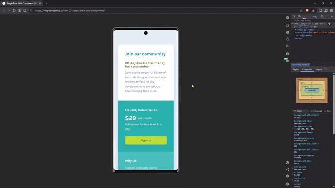

# Frontend Mentor - Single price grid component solution

This is a solution to the [Single price grid component challenge on Frontend Mentor](https://www.frontendmentor.io/challenges/single-price-grid-component-5ce41129d0ff452fec5abbbc). 
The goal was to build a responsive pricing component while maintaining clean structure and accessibility best practices.

---

## 🎯 The challenge

Users should be able to:

- View the optimal layout for the component depending on their device's screen size
- See a hover state on desktop for the Sign Up call-to-action

Although the original challenge did not include interactive states, I implemented hover and focus-visible states to improve accessibility and user experience.

---

## 📸 Screenshots

### 📱 Mobile

### 💻 Desktop

---

## 📽️ Demo

---

## 🔗 Links

- 🌎 [Live site](https://vimpdev.github.io/fem-03-single-price-grid-component/)

<!-- - 👩‍💻 [Frontend Mentor solution](https://your-solution-url.com) -->

---

## 🛠️ Built with

- Semantic HTML5
- CSS custom properties
- Flexbox
- CSS Grid
- Mobile-first workflow
- Accessibility improvements (color contrast & focus states)
- SEO meta tags (Open Graph & X-Twitter Cards)

---

## 🧠 What I learned

This project helped reinforce several important concepts:

- Structuring layouts semantically without unnecessary wrappers
- Managing design tokens using CSS custom properties
- Improving color contrast for accessibility compliance
- Implementing :focus-visible for keyboard navigation
- Writing meaningful commit messages and organizing documentation assets

Adding interactive states, even when not required, reminded me that good UX goes beyond just matching a static design.

---

## 🤖 AI Collaboration

AI tools were used strategically to:

- Reviewing semantic HTML structure
- Refine commit message conventions.
- Improve meta tag implementation (SEO & Open Graph).
- Review accessibility practices.
- Improve documentation quality.

All implementation decisions and final code structure were reviewed and adjusted manually.

---

## 👤 Author

- Frontend Mentor - [@vimpdev](https://www.frontendmentor.io/profile/vimpdev)